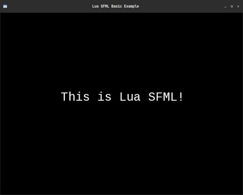

# Lua SFML Binding
Binding SFML to LUA

 

---

# Description
LuaSFML is a lua binding of SFML, which let's you use SFML in your lua script.
> This project is a fork of the [original project](https://github.com/Canadadry/luaSFML) which has been stalled for over 9 years and has compilation and other issues.

---

# Dependencies
+ [gcc/g++](https://gcc.gnu.org/)
+ [SFML](https://www.sfml-dev.org/)
+ [Make](https://www.gnu.org/software/make/)
+ [CMake](https://cmake.org/)
+ [Lua 5.1](https://www.lua.org/)

Example on Ubuntu
```bash
sudo apt install build-essential g++ make cmake lua5.1
```

---

# Building and Instalation

```bash
git clone https://github.com/terroo/luasfml
cd luasfml
mkdir build && cd build
cmake ..
make
sudo make install
```
---

# Basic Example
Comming soon [Wiki](https://github.com/terroo/luasfml/wiki), In the meantime you can learn by the [Examples/Demos](https://github.com/Canadadry/luaSFML/tree/master/demo) .
> If you already know [SFML with C++](https://www.sfml-dev.org/documentation/2.5.1/) and also know [Lua](https://www.lua.org/docs.html), you will adapt easily. If you want to contribute to the documentation, feel free.

File `main.lua`

```lua
window = sfRenderWindow.new(sfVideoMode.new(800,600,32),"Lua SFML Basic Example",sfWindowStyle.Default);

clearColor = sfColor.new(0,0,0);
colorWhite = sfColor.new(255, 255, 255)

font = sfFont.new()
font:loadFromFile("path/to/font.ttf")

message = sfText.new("This is Lua SFML!",font,40);
message:setPosition( 200, 250);
message:setColor(colorWhite)

while window:isOpen() do
  event = sfEvent.new();
  while window:pollEvent(event) do
    if(event:type() == sfEventType.Closed) then window:close(); 
    end
  end
  window:clear(clearColor);
  window:draw(message);
  window:display();
end
```

To run use the `luasfml` command and the name of the *main file* of your project:

```bash
luasfml main.lua
```

This example is available in the [assets](./assets/) directory of that repository. To run:

```bash
cd assets/
luasfml main.lua
```

Possible output:

 

---

# Similar Projects

+ [luaSFML](https://github.com/Canadadry/luaSFML)
+ [Luna](https://github.com/XyronLabs/Luna)
+ [lsfml](https://github.com/Oberon00/lsfml)
+ [LSFML](https://github.com/ief015/LSFML)

---

# Uninstall
```bash
git clone https://github.com/terroo/luasfml
cd luasfml
mkdir build && cd build
cmake ..
sudo make uninstall
```
